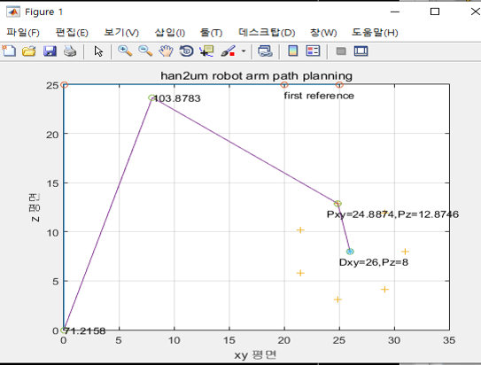

# Kitchen Master
- Initial project released on May.2020
- Go to [Upgrede version](https://github.com/MinTpie30/RobotIntheKitchen) repository 
## Kitchen Master

## 1. Description
This project is implement for Home-Kitchen Automation.

#### Watching Full video about this project : https://youtu.be/_JTMdI2pfQs

## 2. Configuration

### (1) Prototype

#### Robot body

#### System architecture

### (2) Intent Classifier
#### Bags of Words
desc

### (3) Image Processing

#### Object detection : yolo-tiny 

### (4) Trajectory Planning

### Result

A Study on Deep Learning Based RobotArm System [Link](https://manuscriptlink-society-file.s3-ap-northeast-1.amazonaws.com/kips/conference/2020fall/presentation/KIPS_C2020B0162.pdf) 

## Contributors
- Contributors : Junho Shin, Kyusuk Shim

